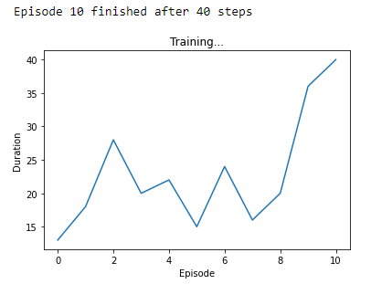
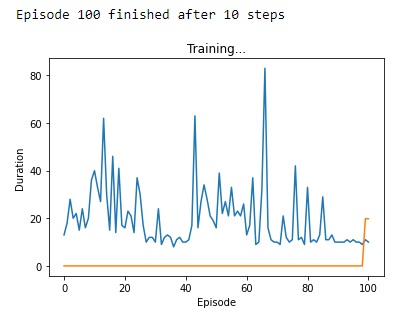

## Video
[Watch the video](https://youtu.be/VSv4HoSgJec)

## Project Summary
Quantum computers are machines that use quantum phenomena such as superposition and entanglement to perform computation. They are believed to solve certain problems substantially faster than classical computers. The most famous quantum algorithm is Shor’s factoring algorithm which has exponential speed-up over any existing classical algorithm [1].

For our project, we will implement a quantum variant of Reinforcement Learning (RL), which employs the Parametrized/Variational Quantum Circuits (PQCs or VQCs). In contrast to most quantum algorithms that require fault-tolerant large-scale quantum computers, this algorithm employs small and low-depth circuits and is flexible under noises, thus it is believed to be useful already on near-term quantum computers. While Google already had a full implementation of the algorithm in tensorflow using Cirq [2], the other widely used quantum programming language Qiskit from IBM hasn’t. Therefore, we would like to fill this gap and have a working PQC-based QRL algorithm in Qiskit.

While the most promising direction is to run the algorithm implemented in Qiskit on real IBM quantum devices, investigate the effects of quantum noises, and demonstrate quantum advantage, it is not realistic due to several reasons: 1. The PQC-based QRL requires thousands of circuit re-runs, which IBM devices disallow. 2. There are many layers of classical processing on IBM’s side, which would be very slow and hinder the accurate benchmark of speed. 3. The circuit requests are usually queued, and there is no guarantee when our requests will be finished (sometimes takes months). Therefore, our work will instead be a proof of concept, where we use classical simulations of quantum circuits to demonstrate this algorithm works and compare it against its classical counterparts. 

## Approach

The algorithm we implemented is based on [3], where the algorithm flow is as follows:

The environment and the gradient algorithm are both implemented classically as the standard RL algorithm, while the policy is encoded in a PQC. The PQC can be thought of as a black box, which takes the state as input and outputs the probability distribution of actions. The gradient can also be calculated directly by applying different measurement observables on the circuit. The PQC architecture is as follows:

where one repetitively applies the entangling layers and encoding layers. The entangling layer applies unitary rotations on each qubit with trainable parameters Φ and applies two qubit-gates on adjacent qubits (under periodic boundary condition) to entangle them. The encoding layer applies another round of rotations with the encoded state as parameters, which are also scaled by trainable weight parameters λ. The unitary rotations can be arbitrarily chosen from any SU(2) rotations generated by Pauli gates, and there is no particular advantage of one over another. To fit this paper’s context, we choose the same convention Ry and Rz, which have the following matrix representation on the computational basis:

The output of the PQC is the probability distribution of measuring each qubit on the computational basis, this needs another layer of processing which will be covered later.

There are many contexts not explained, and interested readers should refer to wiki page https://en.wikipedia.org/wiki/Bloch_sphere#Rotations and more general Quantum Computing tutorials.

To best build our model, we will employ the newly added TorchConnector module in Qiskit. A typical flow looks like this:

where one adopts a neural network-like structure with one layer replaced by the PQC. However, one flaw of the TorchConnector is it can only perform projective measurement on the computational basis, corresponding to the raw-VQC policy in [3]:

while it is proposed in [3] a more general measurement under arbitrary Hermitian observable is required. Therefore, we add an “observable layer” directly after PQC that transforms the projective measurement results into general Hermitain obervables. For now, we only consider the Hermitian Z operator as the observable, and we derived such mapping:

where \|Pa\| is the sum of digits (number of 1s) in the associated action’s binary representation. More general transformations will be implemented in the future. Therefore, our policy will have this underlying flow: 

The output of the observable layer is the probability distribution π(a\|s), which is determined by assigning qubits to each action. For example, if there are 4 qubits q1, q2, q3, q4 and 2 possible actions a1, a2 for each state, then the q1 and q2’s measurement result will be mapped to π(a1\|s) and q3 and q4’s will be mapped to π(a2\|s). Notice because our PQC already encodes the scaling/weight parameters for the state, there’s no need to add another classical layer before PQC. 

For our task, we decided to train the CartPole-v0 task from the OpenAI Gym. In this environment, a pole is attached by an un-actuated joint to a cart, which moves along a frictionless track. The system is controlled by applying a force of +1 or -1 to the cart. The pendulum starts upright, and the goal is to prevent it from falling over. A reward of +1 is provided for every timestep that the pole remains upright. The episode ends when the pole is more than 15 degrees from vertical, or the cart moves more than 2.4 units from the center.

We adopted codes from PyTorch’s tutorials [4] and apply our quantum model to it. In this code, the Huber loss is used for optimization, which is implemented in PyTorch already. We could simply apply the following code without actually coding the gradient algorithm ourselves:

## Evaluation

Firstly, we verified the correctness of our PQC implementation by generating the quantum circuit diagram. As an example, the circuit diagram generated by Qiskit+Matplotlib with 4 qubits/states, 2 possible actions, and 5 layers is as follow:

You can see the state parameters s are multiplied to scaling parameters λ, and weight parameters Φ are put into the entangling layers. For now we are checking the diagram manually, but later we will write a series of unit tests to verify the circuit construction process.

We also verified the implementation of the observable layer. We implement it as computing the dot product between a “mask” vector and the outputs of the PQC circuit. The projective measurements of PQC should yield probabilities over computational basis states \|0000>, \|0001>, \|0010>, …, \|1111>, and let’s denote them as \|ijkl> where i, j, k, l ∈ {0, 1} and d(ijkl) as the base-10 representation of binary number ijkl. Based on our equation of Hermitian Z observables, the d(ijkl)-th element in the first action’s mask vector is 1 if k⊕l=0, and -1 if k⊕l = 1, and the d(ijkl)-th elements in the second action’s mask vector is 1 if i⊕j=0, and -1 if i⊕j = 1. Notice k and l correspond to the first two qubits because Qiskit employs the little-endian convention. We compared this with the mask vectors generated when creating the observable layer:

As one can see, the first vector alternates between -1 and 1, which makes sense if we look at the last two digits of 0000, 0001, 0010, …, and the second one also matches our results as the sign changes every 4 elements. Again, we will set up unit tests and include more test cases.

We also have implemented a working example of CartPole, for which we have plotted the duration it holds (total reward) for every episode. In the first 10 episodes, the reward function had an overall positive trend:

However, as the training continues, the overall positive trend didn’t seem to hold:

The algorithm is very slow because we need to perform a classical simulation of the quantum circuit at each step, and the 100 episodes took around 20 hours to run. For now, it is not sufficient to verify the correctness of the algorithm yet, and this is something we’ll keep working on. However, as we could see our layers' outputs have already been correctly implemented, so we believe it only requires more episodes to generate better results.

## Resources Used / Citations
[1] P. W. Shor, SIAM Journal on Computing 26, 1095-7111 (1997) \
[2] Parametrized Quantum Circuits for Reinforcement Learning, tensorflow, https://www.tensorflow.org/quantum/tutorials/quantum_reinforcement_learning \
[3] Jerbi, et al, Variational quantum policies for reinforcement learning, https://arxiv.org/abs/2103.05577 \
[4] Reinforcement Learning (DQN) Tutorial, PyTorch. https://pytorch.org/tutorials/intermediate/reinforcement_q_learning.html

